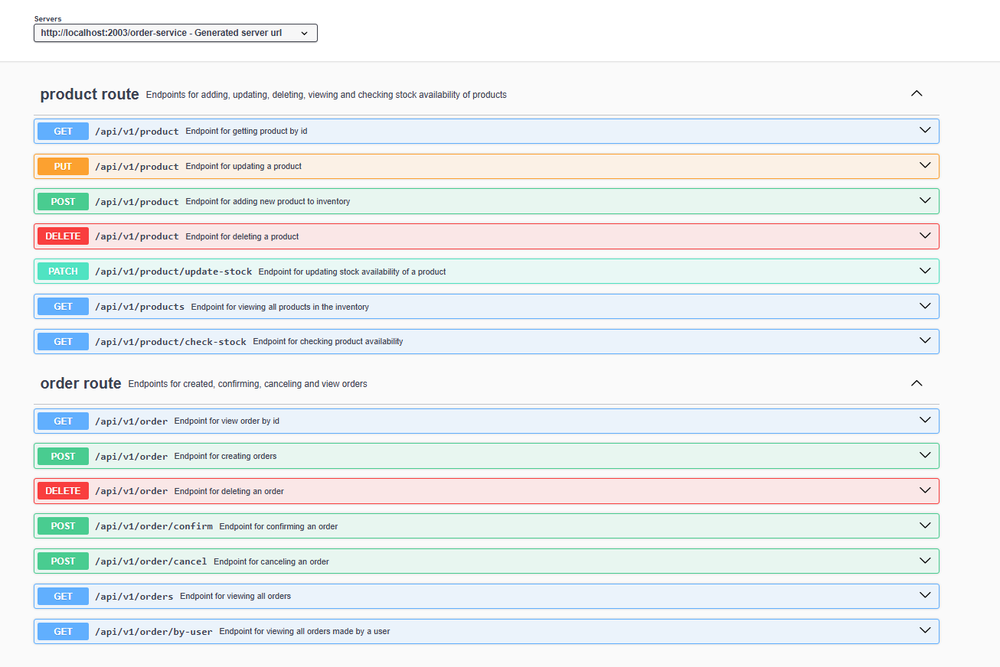
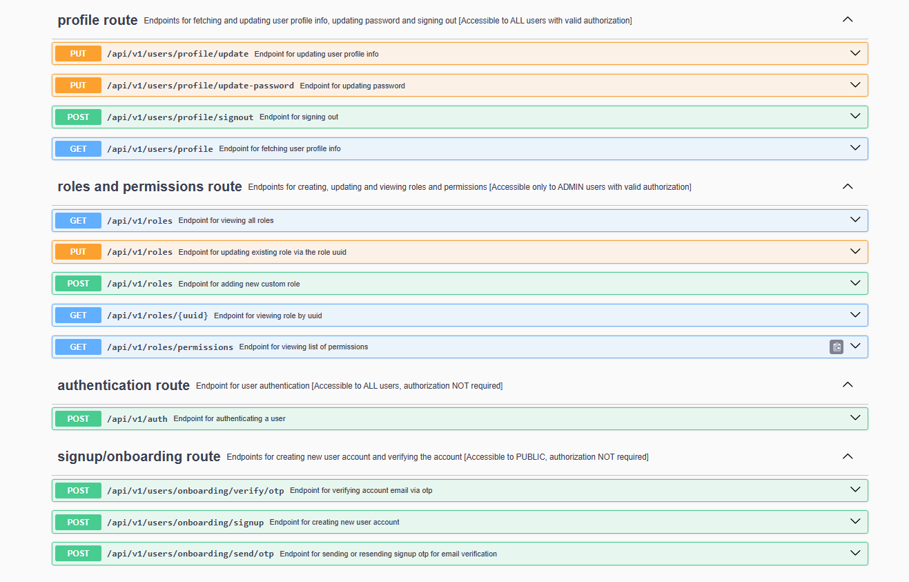
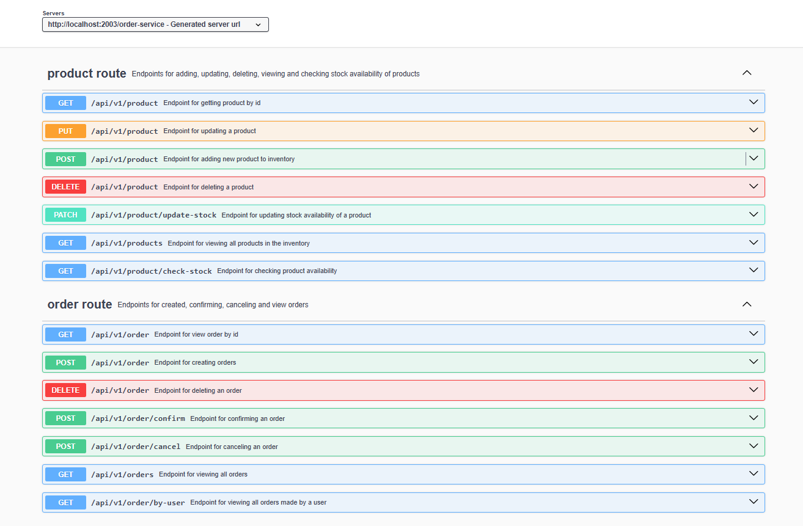

# Order Processing System API



## Overview

The Order Processing System API is a highly scalable and efficient API designed using the Java Spring Boot framework. It leverages gRPC for inter-service communication, ensuring seamless, high-performance interactions between different services. This API is built to streamline the management and ordering of products, catering to various user roles with secure authentication and authorization mechanisms.

The system follows a microservices architecture, dividing responsibilities across multiple independent services to enhance maintainability, scalability, and fault tolerance. The key microservices include:

1. Account Service – Manages user authentication, authorization, and profile details.
2. Config Server/Service – Centralized configuration management to maintain consistent settings across all microservices.
3. Notification Service – Handles email, notifications for account opening.
4. Inventory Service – Tracks product stock levels, availability, and updates inventory in real time.
5. Order Service – Processes customer orders, manages order statuses, confirms and cancels orders and integrates with inventory services.

As you examine the API, be sure to make recommendation or report any issue to the contact listed below.

## Prerequisites

- Desktop Dockers is installed on the host machine
- Docker-compose is installed

## Table of Contents

- [Order Processing System API](#order-processing-system-api)
    - [Overview](#overview)
    - [Prerequisites](#prerequisites)
    - [Table of Contents](#table-of-contents)
    - [General Information](#general-features)
    - [Technologies Used](#technologies-used)
    - [Setup](#setup)
        - [Docker Setup](#docker-setup)
        - [Swagger Endpoint Access](#swagger-endpoint-access)
        - [Access the Database](#access-the-database)
    - [Endpoints](#endpoints)
        - [Account Service Route](#account-service-route)
        - [Order Service Route](#order-service-route)
    - [Contributor](#contributor)

## General Features

This API provides essential functionalities for an order processing system, including:

* Account creation.
* Account verification via OTP.
* Sign in and authorization.
* Adding product to inventory/stock.
* Managing and updating product stock.
* Ordering a product
* Managing orders: Confirming, Canceling etc.
* Profile and account management.
* User management.
* Roles and permissions management.

## Technologies Used

* Language and Frameworks
    * Java Programming Language
    * Java 17
    * Spring Boot 3.4.3
    * gRPC (Inter-service communication)
* Development Tools/IDE
    * IntelliJ IDEA
    * Docker & Docker Compose

## Setup

Clone the repository from: https://github.com/OmameIsaiah/order-processing-system.git to any directory of your choice, then move into to the cloned directory.

```
git clone https://github.com/OmameIsaiah/order-processing-system.git
cd order-processing-system
```

### Docker Setup

This project includes Docker configurations for MySQL, Kafka, and Zookeeper, used for storage and message brokering. The setup includes Dockerfiles and docker-compose configurations for different environments (prod, dev, and test).
To deploy the application using Docker:

* Ensure Docker Desktop is running
* Ensure you are able to login to Docker environment
* On Terminal/Command prompt, move to the order-processing-system directory

```
cd order-processing-system
```

For Windows

```
run-dev.bat
# or
run-prod.bat
# or
run-test.bat
```

For Linux/macOS

```
./run-dev.sh
# or
./run-prod.sh
# or
./run-test.sh
```

This script will build and deploy the API as a container in Docker. The application should be ready in a few minutes.

### Swagger Endpoint Access
There are two major services that are open for frontend consumption: 
* Account Service (Signup, login, email verification, etc.)
  1. Base URL: http://localhost:2001/account-service/
  2. Swagger UI: http://localhost:2001/account-service/swagger-ui/index.html

* Order Service (Product & Order Management)
  1. Base URL: http://localhost:2003/order-service/
  2. Swagger UI: http://localhost:2003/order-service/swagger-ui/index.html


### Access the Database

To connect to the MySQL database, use the following credentials:
```
mysql -u root -h localhost -P 8801 -p
```
Users:

| Username | Password           |
|----------|--------------------|
| root     | dev@OrderPS_2025   | 
| docker   | dev@OrderPS_2025   | 


## Endpoints

he API includes endpoints for user authentication, product management, order management, and role-based access control.

> ⚠️ After creating a new account, an OTP is sent to the registered email for verification and account activation.
> Without verifying the email via OTP, the user will not have access to the account.

### Account Service Route

After successful login/authentication, a bearer token is generated and used to access the order service endpoints
> ⚠️ The bearer token should be preceded by the word 'Bearer' as in the picture below. Eg. Bearer eyJhbGciOiJIUzUxM........



### Order Service Route




## Contributor

| Name         | Email                                       | Contact         | Github                                   |
|--------------|---------------------------------------------|-----------------|------------------------------------------|
| Isaiah Omame | omameazy@gmail.com,<br/> omameazy@yahoo.com | +234 7060812940 | [github](https://github.com/OmameIsaiah) |


